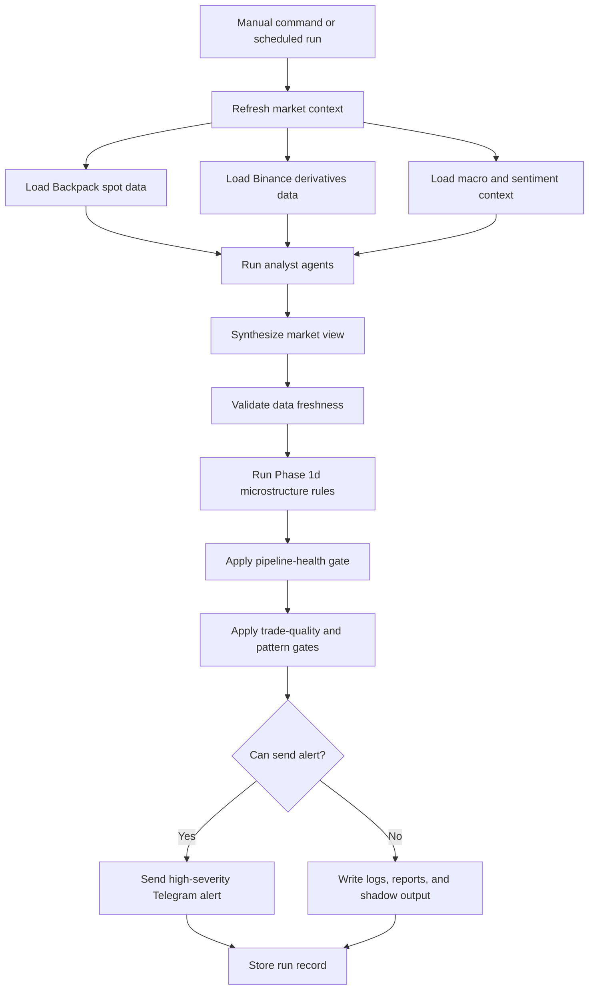

# Market Intel

Market Intel is an experimental trading-research system.

Author: Aziz.

It collects market context for BTC, ETH, SOL, and gold. It combines market data,
agent analysis, deterministic microstructure rules, trade-quality checks, and
pipeline-health checks. The system writes reports and can send Telegram alerts
only when the data and signal quality pass strict gates.

This project is research software. It is not financial advice.

## Current Status

This public repository was cleaned and updated on 2026-08-28.

The current system is no longer only a simple multi-agent market summary. It now
has a stricter alert path:

- Backpack spot data is treated as venue truth for supported spot symbols.
- Binance USD-M data is used for derivatives context.
- Missing or stale data lowers confidence.
- The Phase 1d alert engine checks microstructure signals before delivery.
- Telegram alerts require pipeline health, trade-quality evidence, and pattern
  gates.
- Trade-quality reports use post-fix data only from 2026-06-20 onward.
- The LLM reviewer is advisory. It does not override hard delivery gates.
- Weak or unproven candidates are logged instead of being sent as trade alerts.

The latest manual data refresh in this repository history was on 2026-08-25.
Runtime snapshots, live JSON files, local databases, logs, and private delivery
state are not committed.

## What It Does

Market Intel runs a research pipeline:

1. Refresh market context.
2. Run specialist analysis for crypto, gold, macro, and sentiment.
3. Synthesize the analysis into a market view.
4. Validate candidate signals against data freshness and quality checks.
5. Run deterministic microstructure alert rules.
6. Write reports and state files.
7. Send only eligible high-severity alerts when Telegram delivery is enabled.

The important design choice is that the system prefers silence over weak alerts.
If data is stale, source coverage is incomplete, or the exact signal pattern does
not have enough evidence, the system records the candidate but blocks delivery.

## Pipeline Diagram



The diagram shows the full alert path. The system refreshes context before it
asks the agents for analysis. Then deterministic gates decide if delivery is
permitted.

## Repository Layout

```text
.
|-- README.md
|-- SYSTEM_OVERVIEW.md
|-- PHASE_STATUS.md
|-- config.json
|-- orchestrator.js
|-- agents/
|-- scripts/
|-- docs/
|-- data/
|-- skills/
|-- archive/
`-- .timeline/
```

Key paths:

- `orchestrator.js` is the main deterministic runner.
- `agents/` contains the analyst prompts and agent definitions.
- `scripts/` contains data refresh, alert, health, and report scripts.
- `docs/` contains design notes, postmortems, and operating decisions.
- `data/*.md` contains intentional public report snapshots.
- `skills/` contains local helper skills used by the system.
- `.timeline/` contains dated marker files used to preserve development history
  in Git.

Generated runtime files are intentionally excluded. This includes live JSON,
JSONL, local databases, logs, raw snapshots, token files, and environment files.

## Main Commands

Run the full market pipeline:

```bash
node orchestrator.js
```

Run all configured agent tests:

```bash
node orchestrator.js --test all
```

Run one agent test:

```bash
node orchestrator.js --test crypto_analyst
```

Run Phase 1d alerts without Telegram delivery:

```bash
PHASE1D_DISABLE_TELEGRAM=1 node scripts/phase1d-alerts.js
```

Run pipeline health without Telegram delivery:

```bash
PIPELINE_HEALTH_DISABLE_TELEGRAM=1 node scripts/write-pipeline-health.js
```

Check JavaScript syntax:

```bash
node --check orchestrator.js
node --check scripts/phase1d-alerts.js
node --check scripts/write-pipeline-health.js
```

## Configuration

Runtime configuration lives in `config.json`.

Important configuration values include:

- Run schedule.
- Alert thresholds.
- Cooldown windows.
- Supported crypto, metals, and macro assets.
- Risk defaults.
- Binance context configuration.
- Telegram delivery configuration.
- LLM reviewer configuration.

For Telegram delivery, set your own chat target in local configuration. Do not
commit real chat IDs, tokens, API keys, account names, or private `.env` files.

## Data Policy

The public repository keeps source code, documentation, and selected Markdown
snapshots.

The public repository does not keep:

- Live `data/*.json` or `data/*.jsonl` runtime state.
- Raw market snapshots.
- Local databases.
- Logs.
- Report exports that contain private or local state.
- API keys, Telegram tokens, chat IDs, cookies, or account identifiers.

This means a fresh clone shows the system design and source, but it does not
contain the private live state needed to reproduce past alerts exactly.

## Alert Logic

The alert path has several gates.

Pipeline health must pass first. The system checks whether recent data refresh
jobs are alive and whether key files are fresh enough.

Then the microstructure engine evaluates directional evidence. It looks at
features such as momentum, basis, funding, open interest, volume, liquidation
pressure, and regime context.

Then trade-quality rules decide whether the exact alert pattern has enough
historical evidence. Some patterns are disabled for Telegram delivery until they
prove useful.

Only candidates that pass these gates can become high-severity Telegram alerts.
Everything else remains in logs, reports, or shadow output.

## Important Design Notes

The system became stricter because earlier candidates were often weak,
adverse-first, or based on incomplete context. The current design protects the
delivery channel from noisy signals.

Backpack and Binance are kept separate on purpose. Backpack is used for spot
venue truth where available. Binance derivatives data adds context, but it does
not replace the spot view.

The LLM reviewer is useful for explanation and second-pass review. It is not the
source of truth for delivery. Deterministic gates decide whether an alert can be
sent.

## Limitations

This is an experimental research system.

It can miss signals when data providers fail, when a market changes faster than
the refresh cycle, or when a useful pattern has not collected enough evidence
yet. It can also produce candidates that look interesting but fail delivery
because the quality gate is strict.

Use the output as research context only. Do not use it as an automatic trading
system without separate risk controls, execution checks, and human review.
